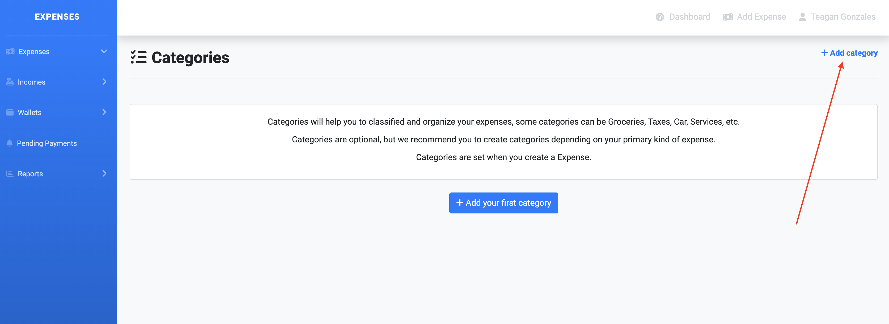
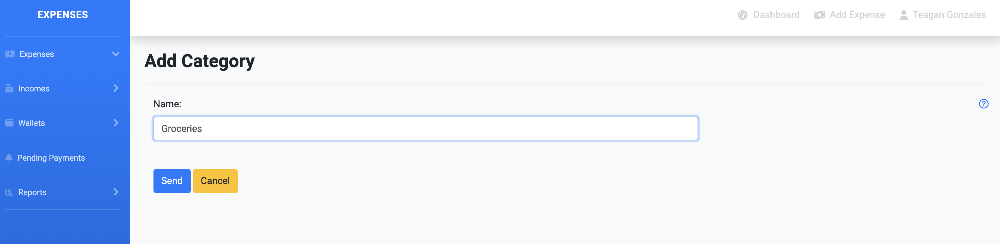

# Categories

Categories are used to classify the expenses in order to get better reporting on the expenses.

Categories are not preset by Expenses, you can create as many categories as you want. Each user will have their own set of categories.

## Create a Category

Go to Expenses > Categories. There you can see a list of all your categories.

The first time it will be empty.

Go to add category and the form to add category will be presented.

