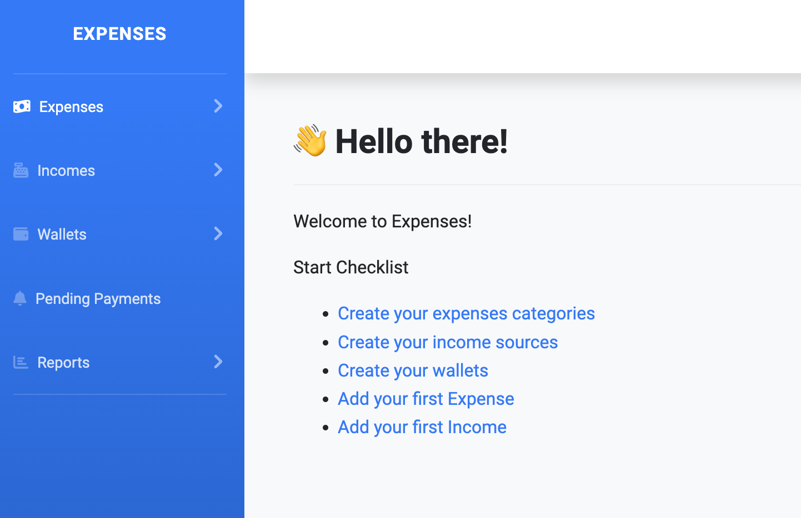

# Onboarding

When you create a new account on expenses a quick onboarding checklist is presented to you.

This checklist will help you to start with expenses.

The checklist has links to task to be done.

The checklist will make you

- Create a Category
- Create an Income Source
- Create a wallet
- Create your first expense
- Create your first income

When all task are done, the checklist will disappear and the dashboard will be presented.